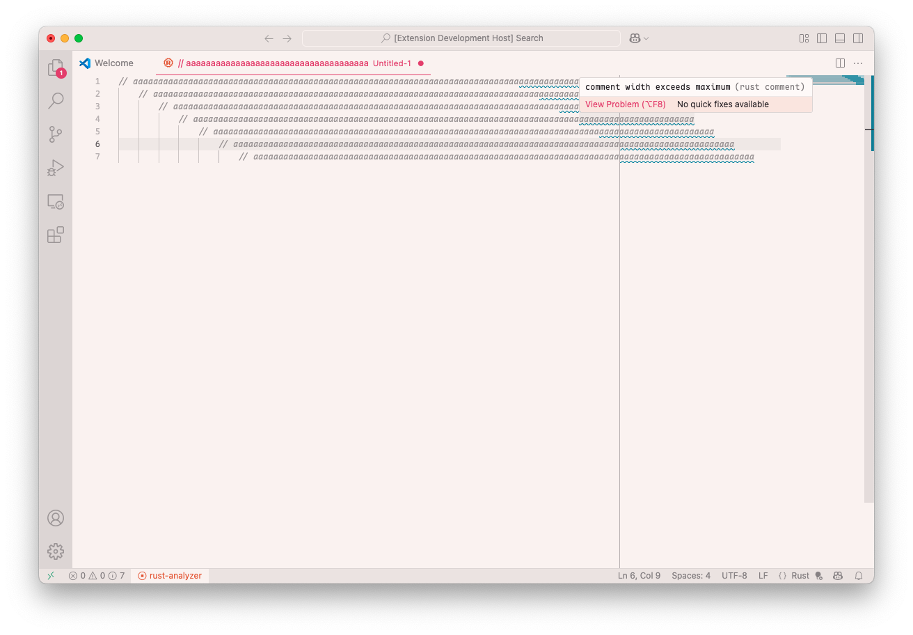

# VS Code extension rust-comment

## Features

## Known Issues

Not handling block comments.

Not handling tabs.

## Release Notes

### 0.0.2

Lower the required version for VS Code to be Cursor-compatible.

### 0.0.1

Initial release of rust-comment
